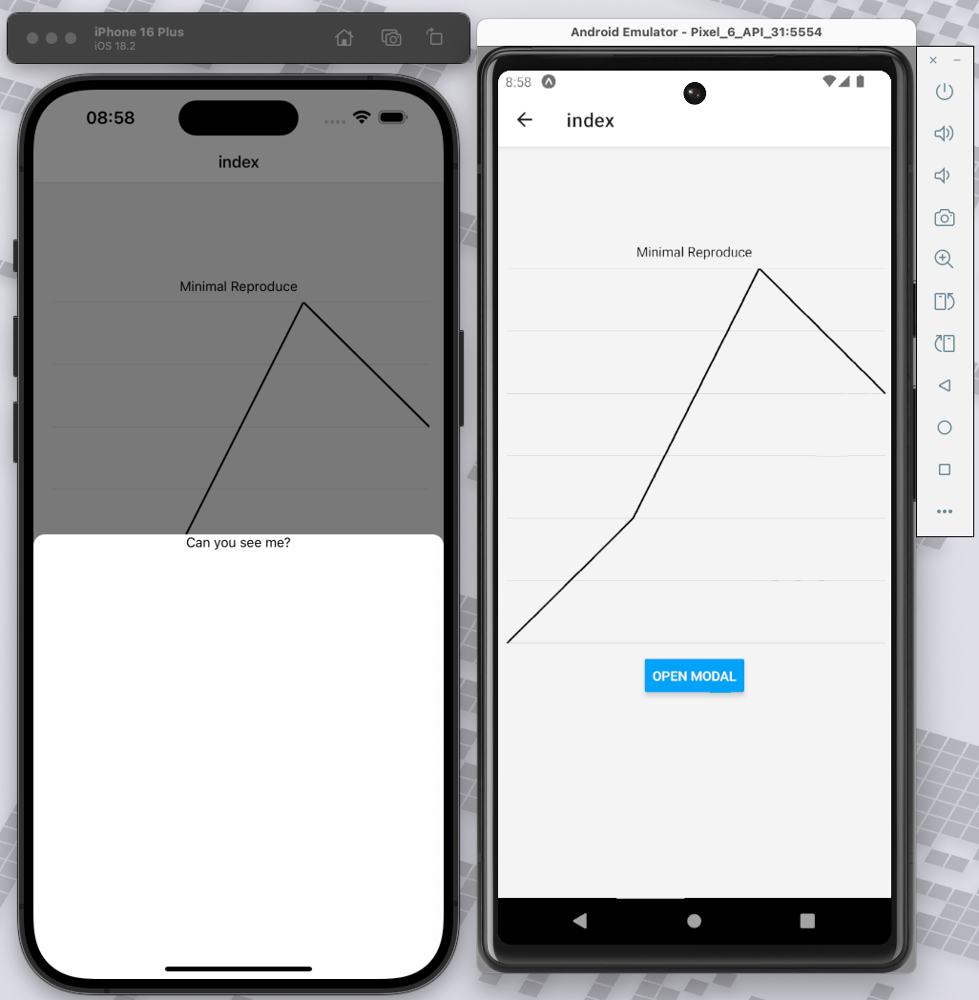

This repo is used to reproduce a issue in victory-native.

## Steps to reproduce
1. Clone the repo
2. Run `npm i`
3. Run `npm start android`
4. Click on the button to get to the screen from the screenshot
5. Click 'Open Modal'
6. On ios the modal opens just fine, in android the modal is not visible. Only the bottom bar becomes black.
7. See the screenshot for the difference between ios and android
8. If you comment out the chart and open the modal, android works just fine.